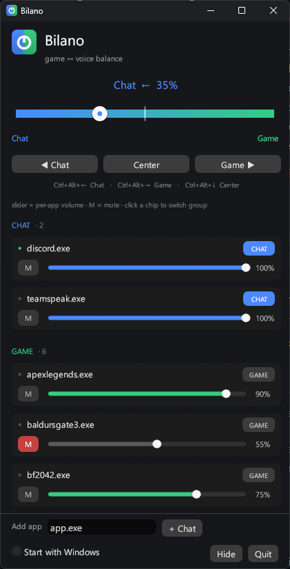

# Bilano

**One dial to balance game audio against voice chat on Windows.** Drag toward Game
and your chat apps fade down; drag toward Chat and the game does. No virtual audio
driver, no installer, no runtime — a single 3 MB `.exe`.

The name is from Latin *bilanx*, "two scale-pans" — the root of the word *balance*.
One beam, a pan on each side.

<p align="center">
  
</p>

- 🪶 **Tiny** — a single self-contained `.exe` (~3 MB). No installer, no drivers, no .NET.
- 🎚️ **One dial** — slide from Game to Chat; the other side fades down, center = both full.
- 🎧 **Per-app** — tag which apps are voice chat (Discord, etc.); everything else is "game".
- 🔊 **Per-app volume + mute** — trim any app under its group level.
- ⌨️ **Global hotkeys** — adjust the mix without leaving your game.
- 🧹 **Clean** — no background driver; restores every app to full volume on quit.

Same idea as the game/chat balance dial built into some gaming headsets — but done
in software, so it works with any headset and there's nothing to install.

If you came here looking for **chatmix** for a headset that doesn't have it, or
without installing a vendor audio driver to get it: that's what this is.

**[bilano website →](https://tiagoneto93.github.io/bilano/)** — try the dial in your
browser before you download anything.

## Install

1. Download the latest `Bilano-vX.Y.Z-win64.zip` from the [**Releases**](../../releases) page.
2. Unzip and run `bilano.exe`.
3. The app isn't code-signed, so **Windows SmartScreen** will warn on first run —
   click **More info → Run anyway**. Your **antivirus may also flag/quarantine** an
   unknown unsigned exe; whitelist the folder if needed.

Requires 64-bit Windows 10/11. Nothing else to install.

Each release also publishes `SHA256SUMS.txt` so you can check what you downloaded.
See the [changelog](CHANGELOG.md) for what changed between versions.

## Usage

- **Drag the slider** toward **Game** to fade voice chat down, toward **Chat** to fade
  the game down. **Center** = both at full volume.
- In the **Apps** list, tick the apps that are voice chat. You can also add one by name.
- **Tray icon:** left-click opens the window; right-click gives a quick tag list + Quit.
- **Global hotkeys** (work in-game):
  - `Ctrl+Alt+←` — toward Chat
  - `Ctrl+Alt+→` — toward Game
  - `Ctrl+Alt+↓` — re-center
- Closing the window hides it to the tray; quit from the tray menu.
- **Start with Windows** and your settings are remembered between runs.

Settings are stored at `%APPDATA%\bilano\config.json`.

> **Upgrading from ChatMix 1.x?** Bilano is the same app, renamed. On first launch it
> moves your old `%APPDATA%\chatmix` config across, so your tags, trims and mutes carry
> over, and it repoints "Start with Windows" at the new exe. Delete the old
> `chatmix.exe` afterwards.

## How it works

Windows gives every app that plays sound its own volume via the Core Audio API.
Bilano simply **ducks** those per-app volumes: it classifies each app as Chat or
Game and, as you move the dial, attenuates the opposite group using a smooth
decibel taper. No virtual audio device is created — which is why it's a single small
exe with nothing to install. Everything is restored to full volume when you quit.

## Build from source

Requires the Rust MSVC toolchain (`rustup`) and the MSVC build tools + Windows SDK.

```powershell
cargo build --release
# output: target\release\bilano.exe
```

The release profile links the CRT statically (`.cargo/config.toml`), so the exe has
no external runtime dependency. See [`CLAUDE.md`](CLAUDE.md) for the full architecture
notes and build gotchas.

## Roadmap

- [x] Per-app volume + mute (v1.6)
- [x] Chat/Game sections with live re-grouping; resizable window; compact footer; start-in-tray autostart (v1.7)
- [x] Renamed to Bilano; first public release (v2.0)
- [ ] MIDI / hardware-knob binding for a physical dial

## License

[MIT](LICENSE) — use it, fork it, ship it. Just keep the copyright notice.
